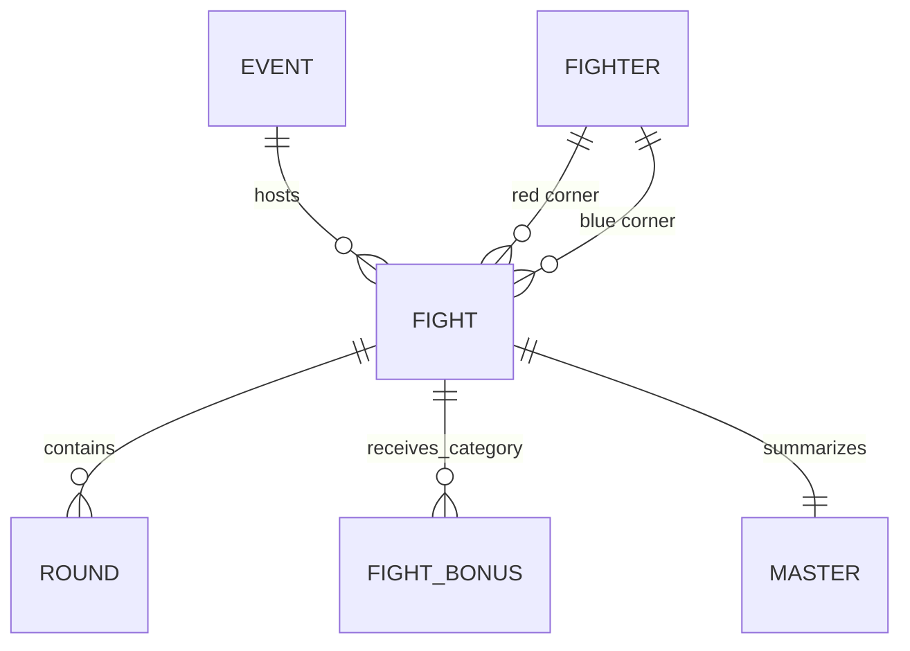

# Data scope and methodology

## Source and reproducibility

The seven supplied CSVs are a local snapshot of [UFC Datasets 1994–2026 on Kaggle](https://www.kaggle.com/datasets/neelagiriaditya/ufc-datasets-1994-2025). Scrape error timestamps are 11 August 2026; observed event dates run from 12 November 1993 through 8 August 2026. These dates describe the files, not an independently verified event census. Do not treat the snapshot as a live feed.

Original bytes are preserved under `data/raw/`. SHA-256 hashes and byte sizes are in `manifest.json`; Git attributes prevent CSV newline conversion. `python -m src.pipeline --all` rebuilds preparation, research tables, models, figures and findings. No credentials are needed. Trusted, locally generated pickle caches are ignored by Git; the dashboard rebuilds from CSVs. Do not load downloaded pickle/model files from untrusted sources.

The source's redistribution/license terms have not been independently established. No repository license is assigned to the third-party data.

## Tables, grains and relationships

| Source | Rows × columns | Grain and key | Role |
|---|---:|---|---|
| event.csv | 1,259 × 4 | Event; `event_id` | Name, date, location |
| fight.csv | 11,441 × 14 | Fight; `fight_id` | Event and corner IDs, result, method, division, title flag, clock and schedule |
| fighter.csv | 4,581 × 16 | Profile; `fighter_id` | Name, physical traits, DOB, stance, snapshot career rates |
| fighter_bonus.csv | 2,409 × 2 | Fight/category; `(fight_id, bonus_type)` | Decorated fights, without recipient IDs |
| master.csv | 11,441 × 93 | Fight; `fight_id` | Denormalized joins and round totals |
| round.csv | 25,131 × 48 | Fight/round; `(fight_id, round_no)` | Both corners' striking, grappling and control |
| scrape_error.csv | 330 × 9 | Logged error; `error_id` | All are unresolved `PartialFightParse` errors |

`fight.event_id → event.event_id`; both fight corners reference fighter IDs; rounds and bonuses reference fight IDs. Joins validate their intended cardinality. There are no duplicate source rows, duplicate primary keys or orphan references in this snapshot. Eight repeated fighter names span 16 distinct IDs, so identity is never resolved by name. The profile table also has 457 fighters without any fight in the snapshot.

The generated [data dictionary](outputs/tables/data_dictionary.csv) lists every source column, inferred dtype, null count, unique count and example values. [Category counts](outputs/tables/category_counts.csv), [date coverage](outputs/tables/date_coverage.csv) and per-file samples complete the inspection.

### Key variable definitions

- `r_id`, `b_id`: source corner IDs. They are not an outcome-neutral random assignment.
- `round` / `finish_round`, `time` / `finish_time`: ending round and elapsed clock within it, not total fight duration.
- `time_format`: scheduled round lengths, including overtime and historical formats.
- `sig_landed`, `sig_atmp`: significant strikes landed and attempted; `total_str_*` includes other strikes.
- `td_success`, `td_atmp`: landed and attempted takedowns. `sub_att`, `rev`, `kd`: submission attempts, reversals and knockdowns.
- `ctrl`: control clock, parsed to seconds. Missing control remains unknown.
- Head/body/leg and distance/clinch/ground are two separate decompositions of significant strikes, not six additive categories.
- `slpm`, `sapm`, `td_avg`, `str_acc`, `str_def`, `td_acc`, `td_def`, `sub_avg` in fighter profiles describe the scrape-time career snapshot. They are never used to predict historical fights.

## UFC scope

The file title is broader than its contents: other promotions and feeder series are included. Scope is set by event names before aggregating fights:

- Include names starting with UFC, Noche UFC, The Ultimate Fighter, Ultimate Ultimate or Ultimate Japan.
- Include the specifically named `Ortiz vs Shamrock 3: The Final Chapter` card.
- Exclude Road to UFC, DWCS and other promotions from UFC headline totals and prior-UFC history.
- Restrict the reporting window to 1994–2026. Eight UFC 1 bouts in 1993 remain in preparation and contribute to earlier-date history.

This yields **8,820 fights, 783 events and 2,735 observed fighters**. Another 475 source events are outside UFC scope. Classification is reproducible but name-based; a new snapshot requires reviewing unfamiliar event names. All raw fight rows remain in the processed fact, with `is_ufc` and `in_scope` flags.

2026 stops on 8 August. Annual growth is withheld for that partial year. Calendar decades provide transparent descriptive era bins; they do not claim to identify exact historical regime changes. The first reporting bin begins in 1994 even though its decade label includes 1993.

Country/territory is the last comma-delimited location component; city is the first. Puerto Rico remains a separate source label, so the count is **31 countries or territories**, not 31 sovereign states. All 783 scoped event locations are populated. There are no venue or reliable card-order columns; venue rankings and main-event claims are withheld.

## Cleaning and missingness

- Preserve source weight-class text as `weight_class_raw`. Recognize named division substrings in tournament labels; preserve women's divisions; group unrecognized labels as `Other / unspecified`. `Superfight` maps to `Open Weight`. Normalized division labels do not imply identical rules across eras or promotions.
- Parse dates explicitly and height to inches. Convert clocks only when they match nonnegative minutes and seconds 00–59. Invalid analytical values become missing, with a quality ledger entry.
- Height, reach and weight sanity ranges are broad: 48–96 inches, 45–100 inches and 80–800 lb. The three historical profile weights over 400 lb are flagged and retained rather than silently declaring open-weight athletes invalid.
- Mask age outside 16–65 years. One source DOB implies an implausible age in a non-UFC bout; it is retained in raw data and masked analytically. Scoped fight appearances have 144 missing ages.
- All 330 logged scrape failures correspond to bouts with no round rows. An additional WEC bout has only one of two expected rounds. The scoped UFC subset has **21 fights without round statistics**, concentrated in 1994–1998; the partial WEC sequence is outside headline scope.
- `master.csv` fills the 330 absent-round fights with zero totals and `rounds_fought=0`. Rebuild totals from `round.csv`, require all rounds 1 through the ending round, and leave incomplete totals missing. An observed zero attempts value is valid; an absent record is not.
- A statistic's fight total is missing if any contributing round is missing that statistic. This matters especially for control. Missing landed/attempted pairs and negative values are not imputed for descriptive analysis.
- One event contains repeated fighter pairings. Keep distinct fight IDs because historical tournaments can produce rematches; no automatic deduplication by event and names occurs.

Review [quality_checks.csv](outputs/tables/quality_checks.csv), [audit_checks.csv](outputs/tables/audit_checks.csv) and [coverage_by_year.csv](outputs/tables/coverage_by_year.csv). Missingness is not random: early-event performance summaries describe the observed subset.

## Metrics and denominators

| Metric | Numerator / denominator |
|---|---|
| Finish share | KO/TKO + submission bouts / all selected bouts |
| KO/TKO share | KO/TKO including doctor stoppages / all selected bouts |
| Decision share | Decision bouts with a win result / all selected bouts |
| Fighter win rate | Wins / decisive win-or-loss appearances |
| Fighter finish-win rate | KO/submission wins / all fighter appearances |
| Finish share of wins | KO/submission wins / fighter wins |
| Significant-strike accuracy | Landed / attempted, undefined when attempts are zero |
| Takedown defense | 1 − opponent landed / opponent attempted, undefined with zero attempts |
| Pooled strikes/minute | Sum landed / sum observed fighter-minutes |
| Pooled takedowns/15 min | 15 × sum landed / sum observed fighter-minutes |
| Round finish risk | KO/submission endings in round / bouts reaching that round |
| Decorated-fight rate | Distinct fights with ≥1 bonus category / all selected fights |

Draw/no-contest status takes precedence over the method field. Other endings include DQ and unusual outcomes. KO and TKO are combined in the source and cannot be separated reliably. Normalized outcome shares sum to 100%; narrow finish and decision shares need not.

Rates in the division/fighter profile tables are means of fight-level rates. The Striking & Grappling tables instead pool counts over exposure. They answer different questions and are labeled accordingly. Control share requires known control and positive duration.

Fight duration sums actual scheduled lengths of preceding rounds plus the ending clock. No-time-limit first rounds use their observed clock; unlimited-round formats repeat their documented round length. Timing that contradicts a schedule is missing rather than forced into a five-minute rule.

Percentage fighter rankings require at least 10 decisive fights by default. Career spans are observed first-to-last fight intervals, not completed career lengths. Conservative win streaks reset after a date with mixed or unresolved results because tournament order is not known.

## Bonus attribution

Each source row identifies a fight and category. A fight can have multiple categories. Recipient identities and award amounts are absent. Performance, KO and submission fighter-recipient rankings are therefore not published. Fight of the Night tables count appearances by both participants in decorated bouts and explicitly label these as appearances, not verified payments or award receipts.

## Statistical interpretation

Winner/loser differences are paired within bouts. The nine exploratory Wilcoxon comparisons report Holm-adjusted p-values, paired standardized effects, and 2,000-repetition event-bootstrap intervals for mean differences. Signed-rank interpretation requires symmetric differences and independent pairs; the latter is imperfect because athletes recur. Event resampling addresses within-card dependence, but not every cross-card fighter dependence.

Attribute win shares report both Wilson and event-bootstrap intervals; equal or missing attributes and unresolved outcomes are excluded. Age advantage means the older fighter when computing the raw table, not a presumed benefit. Height/reach correlations use one row per fighter; pooling divisions can inflate these correlations.

Division/method chi-square analysis restricts to KO/TKO, submission and decision fights and divisions with at least 100 total bouts. It reports minimum expected counts and Cramér's V. Title-duration comparisons restrict to standard five-round schedules and report Mann–Whitney and rank-biserial effect size. Their null is distributional equality, not specifically equal means. Tests are exploratory, not confirmatory causal estimates.

The division-mix comparison fixes pooled weights across divisions with at least 50 fights in both 2010–2019 and 2020–2025. This provides a composition diagnostic, not a fully adjusted causal model. The descriptive duration curve counts all endings; it is not a censoring-based survival estimate.

## Prediction and leakage controls

- Histories include only earlier **dates**, never the current bout or another bout that day. Same-day tournament results cannot leak across ambiguous ordering.
- Feature allowlist: age difference and differences in prior UFC bouts, wins, losses, win rate, KO/submission rates, win streak, title bouts, striking and takedown rates; current division is categorical.
- Stance, weight, reach, height and lifetime performance snapshots are excluded from models because historical availability is not documented. Age assumes DOB is stable and accurate.
- A deterministic SHA-256 bit assigns fighter A/B independently of the outcome. Fight IDs, corner identity and fighter names are metadata, not features. A red-corner heuristic is reported separately as a stronger context comparator.
- Train: 1994–2019. Validation: 2020–2022. Select model by lowest validation log loss. Refit fixed candidates through 2022 and evaluate once on 2023–2026. All preprocessing is fitted inside the relevant training pipeline. The 0.5 classification threshold is fixed.
- Sequential replay permits earlier test bouts to update later test histories. Parameters do not refit during test. This differs from forecasting the entire test period at its start.
- Profile histories cannot reconstruct when overturned results or source corrections first became public. No retrospective dataset alone proves real-time information availability; this remains a limitation.
- Fighters recur across splits. Evaluation describes future bouts, not entirely unseen-fighter generalization. Subgroups below 30 fights are withheld; other subgroup differences remain descriptive.
- Model artifacts are local rebuilds, excluded from Git. Dashboard replay uses saved held-out predictions. It does not claim live predictions or betting value.

References: [scikit-learn leakage guidance](https://scikit-learn.org/stable/common_pitfalls.html#data-leakage), [evaluation metrics](https://scikit-learn.org/stable/modules/model_evaluation.html), [SciPy signed-rank assumptions](https://docs.scipy.org/doc/scipy/reference/generated/scipy.stats.wilcoxon.html).
