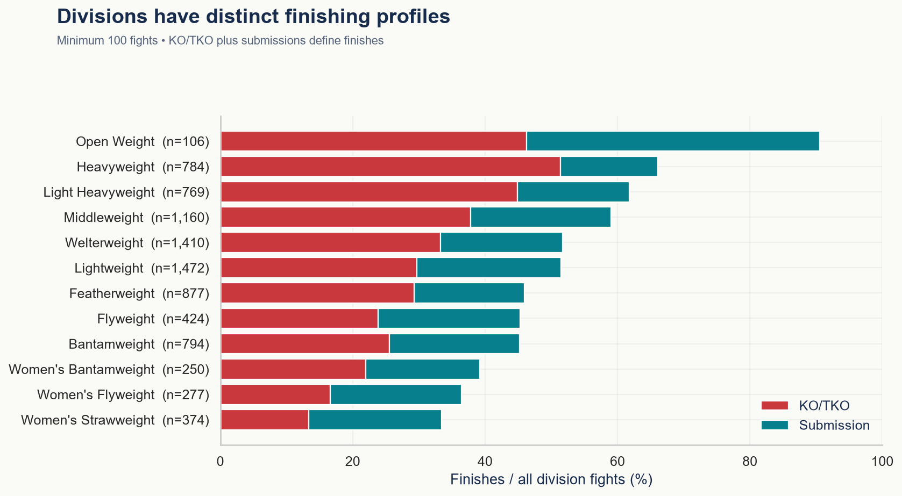
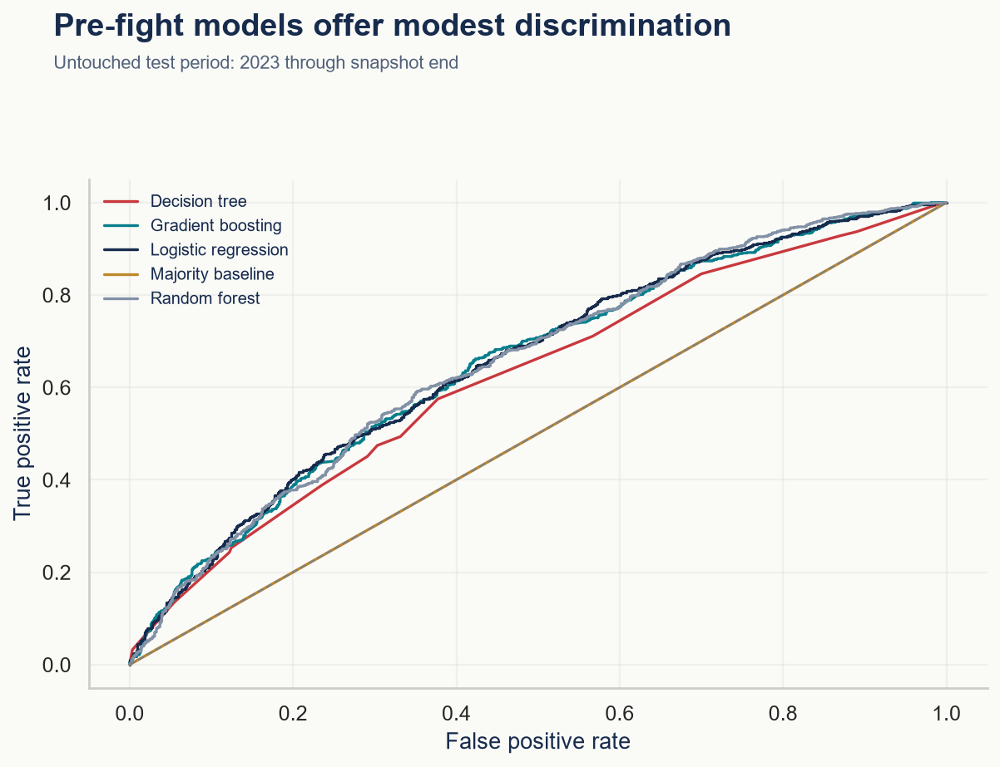

# UFC Analytics: Evolution, Fighters & Fight Outcomes

## Project Overview

An end-to-end study of UFC growth, fighter characteristics, fighting styles and outcomes, combining auditable preparation, eight research notebooks, statistical inference, pre-fight prediction and an interactive Streamlit application.

The central question is **what changes when UFC grows and its division mix changes?** The analysis distinguishes aggregate trends from composition effects and descriptive fight statistics from information available before a bout.

**8,820 UFC fights · 783 events · 2,735 fighters · 1994–8 August 2026**



## Dataset

Source: [UFC Datasets 1994–2026 — Kaggle](https://www.kaggle.com/datasets/neelagiriaditya/ufc-datasets-1994-2025).

| File | Rows | Main variables and relationship |
|---|---:|---|
| `event.csv` | 1,259 | Event ID, name, date and location |
| `fight.csv` | 11,441 | Fight ID, event ID, fighter IDs, result, division and timing |
| `fighter.csv` | 4,581 | Fighter ID, physical traits, DOB, stance and career snapshot |
| `fighter_bonus.csv` | 2,409 | Fight/category pairs; no recipient IDs |
| `master.csv` | 11,441 | Denormalized fights, profiles and aggregate statistics |
| `round.csv` | 25,131 | Fight/round pairs, both corners' striking, grappling and control |
| `scrape_error.csv` | 330 | Unresolved missing-round-stat parse errors |

Raw coverage is **12 November 1993–8 August 2026** and includes non-UFC promotions. Headline analysis selects UFC cards and TUF finales in 1994–2026; feeder series are excluded. Eight 1993 UFC bouts remain available for historical features. **2026 is partial.**

Raw files are preserved with SHA-256 checksums. See the [data dictionary](outputs/tables/data_dictionary.csv) and [scope and methodology](DATA_NOTES.md).

## Project Objectives

- Explain expansion, participation and geographic representation.
- Compare finishing behavior, duration and styles across divisions and eras.
- Separate fighter longevity from efficiency with minimum-sample leaderboards.
- Quantify associations between age, reach, performance and winning.
- Evaluate prediction using strictly prior-date UFC histories.

## Tools & Technologies

Python 3.13, NumPy, Pandas, SciPy, Matplotlib, Seaborn, Plotly, Scikit-learn, Streamlit, Jupyter notebooks, pytest and Git. Dependency versions are pinned in `requirements.txt`.

## Data Preparation

The pipeline validates keys and join cardinality, normalizes divisions, parses historical round schedules, and creates fight, fighter-appearance and round-level tables. Missing statistics remain missing: the source master zero-fills 330 absent-round bouts, which would bias activity measures.

Historical features use **earlier dates only**, excluding every bout on the current date. Profile career averages and current-bout statistics are excluded from prediction. No raw rows are silently deleted; scope flags and quality ledgers explain inclusion.

## Analysis

| Notebook | Research focus |
|---|---|
| [01 · Data understanding](notebooks/01_data_understanding.ipynb) | Schemas, grains, relationships, missingness and limitations |
| [02 · Cleaning](notebooks/02_data_cleaning.ipynb) | Auditable transformations, duration rules and historical features |
| [03 · UFC history](notebooks/03_eda_ufc_history.ipynb) | Growth, geography, events, representation and eras |
| [04 · Fighters](notebooks/04_fighter_analysis.ipynb) | Career rankings, physical traits, stance and divisions |
| [05 · Fights](notebooks/05_fight_analysis.ipynb) | Outcome shares, duration and division-mix adjustment |
| [06 · Rounds](notebooks/06_round_analysis.ipynb) | Finish risk, striking, grappling, control and bonuses |
| [07 · Statistics](notebooks/07_statistical_analysis.ipynb) | Paired effects, confidence intervals and exploratory tests |
| [08 · Machine learning](notebooks/08_machine_learning.ipynb) | Chronological evaluation, baselines and calibration |

## Key Results

- **Composition changes the story:** decisions rise from **48.24%** in 2010–2019 to **48.93%** in 2020–2025 overall. Holding shared division weights fixed yields **48.94% → 47.82%**.
- **Heavyweight bouts have a 51.4% KO/TKO rate**, versus **32.8% overall**.
- **Reach has a modest association:** the longer-reach fighter wins **52.0%** of 6,629 eligible fights; the event-bootstrap 95% interval is **50.8%–53.2%**.
- **Younger fighters win more often:** the older fighter wins **42.9%** of decisive unequal-age bouts. Winners are **0.89 years younger** in paired comparisons.
- **Round risk declines among survivors:** standard three-round bouts have conditional finish rates of **26.8%, 22.2% and 13.6%** for rounds 1–3.

These are observational associations. [Sixteen findings](FINDINGS.md) provide evidence, interpretation and source-table references.

## Machine Learning

The winner model uses age difference, prior UFC experience, results, streaks and historical striking/grappling rates, plus division. A/B identity is assigned independently of outcomes. Preprocessing is fitted within training pipelines.

| Period | Purpose | Fights |
|---|---|---:|
| 1994–2019 | Training | 5,366 |
| 2020–2022 | Validation and model selection | 1,447 |
| 2023–8 August 2026 | Held-out evaluation | 1,851 |

Gradient boosting was selected by validation log loss before test evaluation. Final candidates fit through 2022.

| Test model | Accuracy | ROC-AUC |
|---|---:|---:|
| Majority baseline | 49.5% | 0.500 |
| Logistic regression | 60.6% | 0.656 |
| Decision tree | 59.9% | 0.622 |
| Random forest | 61.2% | 0.655 |
| **Gradient boosting — validation-selected** | **60.3%** | **0.652** |

The selected model's event-bootstrap accuracy interval is **58.1%–62.6%**. A source red-corner heuristic achieves **55.7%**. The best test score does not change model selection. [Complete metrics](outputs/tables/model_metrics.csv) include precision, recall, F1, Brier score and log loss.



Evaluation is sequential replay: earlier test outcomes may update later histories while model parameters stay fixed. Snapshot corrections cannot be reconstructed as known in real time. This is an analytical demonstration, **not a betting system**.

## Repository Structure

```text
data/raw/            Original CSVs and checksum manifest
data/processed/      Analytical fight CSV; local rebuild caches
notebooks/           Eight executed research notebooks
src/                 Preparation, analysis, inference, modeling and reporting
dashboard/app.py     Streamlit application
outputs/charts/      Analytical PNG figures
outputs/tables/      Research results, quality checks and model evaluation
tests/               Mathematical, integrity and application checks
DATA_NOTES.md        Scope, definitions, assumptions and limitations
FINDINGS.md          Sixteen evidence-based findings
```

## Future Improvements

Validate against an independent event census, add timestamped updates, evaluate expanding-window backtests and opponent-adjusted Elo, and incorporate licensed odds or rankings only when historical availability can be established.

## Contact

For any inquiries or questions regarding the project, please contact me at: [dbui10@fordham.edu](mailto:dbui10@fordham.edu)