# UFC research questions and answers

46 additional questions extend the eight original notebooks. Each answer is calculated from the preserved local snapshot and links to its supporting evidence. Inactivity research is included in notebook 04, bonuses in notebook 06, and Elo/generalization in notebook 08.

These are exploratory observational analyses. Full 2025 is used for annual comparisons; 2026 is partial where retained. Wilson intervals describe binomial uncertainty without fighter/event clustering. Event-bootstrap intervals preserve dependence within events, but not recurring fighters across events. Intervals are pointwise and do not correct for selection across this question catalog.

## Browse the research

- [01 · Where can the dataset mislead us?](#research-01)
- [02 · How sensitive are the results to cleaning and metric definitions?](#research-02)
- [03 · What drives growth, geographic spread and fighter turnover?](#research-03)
- [04 · What do rankings, debut matchups and early careers really reveal?](#research-04)
- [05 · Can composition, schedules and rematches explain outcomes?](#research-05)
- [06 · What changes within fights after accounting for exposure and survival?](#research-06)
- [07 · Which physical associations survive adjustment and sensitivity checks?](#research-07)
- [08 · Which features help, when does the model fail, and how robust is its lift?](#research-08)
- [09 · How do bonus era and award category change the interpretation?](#research-09)
- [10 · Does opponent strength improve pre-fight prediction?](#research-10)
- [11 · What changes after a long gap between UFC appearances?](#research-11)
- [12 · How does the frozen model generalize across fighter familiarity?](#research-12)

<a id="research-01"></a>

## 01 · Where can the dataset mislead us?

[Executed notebook](notebooks/01_data_understanding.ipynb) · [Answer data](outputs/tables/research_01.json)

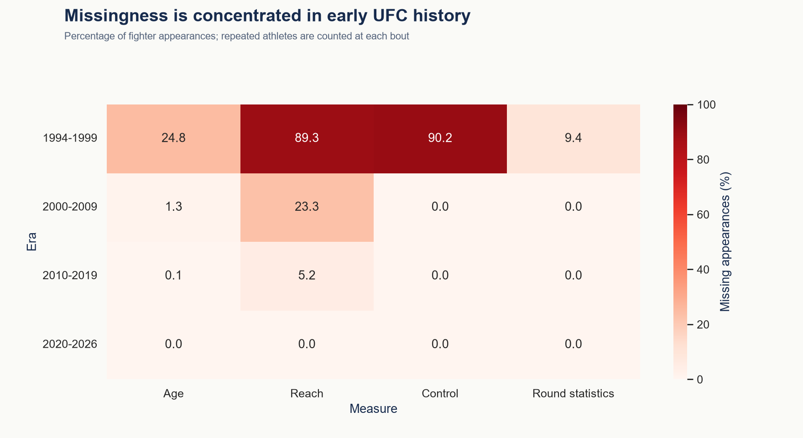

### How much would using the complete master change the UFC population?

It would add 2,621 fights (22.9% of all source fights) beyond the 8,820-fight reporting cohort.

**Interpretation and limits:** This is a scope mismatch, not additional UFC coverage. Non-UFC results must not enter UFC counts or prior-UFC records.

[Supporting table](outputs/tables/deep_scope_bias.csv)

### Are missing round statistics a random subset of UFC fights?

21 scoped fights lack statistics; their mean event year is 1996.0.

**Interpretation and limits:** Coverage differs historically. Modern activity cannot be fairly compared with early raw totals without displaying observation rates.

[Supporting table](outputs/tables/deep_missing_selection.csv)

### How much does zero-filling missing fights change average striking totals?

The source master gives 73.89 combined significant strikes per scoped fight; the complete observed subset gives 74.06.

**Interpretation and limits:** The aggregate difference is small because scoped missingness is rare, but early-period comparisons can be affected much more. Missing control is a separate coverage problem.

[Supporting table](outputs/tables/deep_zero_bias.csv)


<a id="research-02"></a>

## 02 · How sensitive are the results to cleaning and metric definitions?

[Executed notebook](notebooks/02_data_cleaning.ipynb) · [Answer data](outputs/tables/research_02.json)

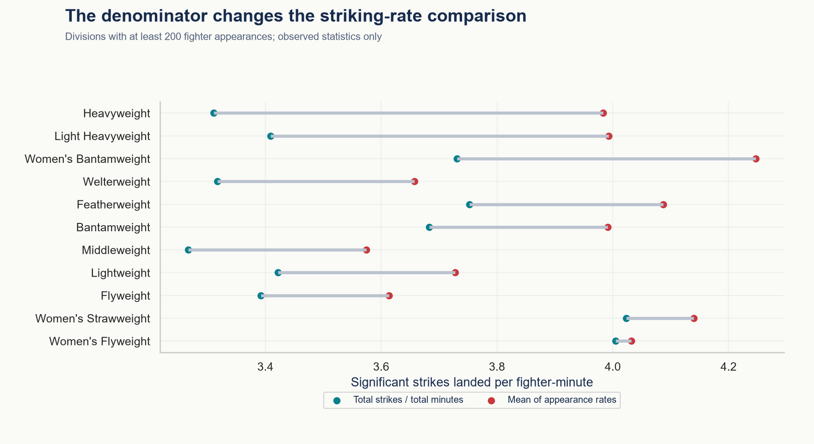

### How many UFC durations would a universal five-minute formula misstate?

29 fights have different durations under the naive formula; the largest error is 1560 seconds.

**Interpretation and limits:** Historical schedules require their documented round lengths. The schedule-specific audit shows which eras and formats are affected.

[Supporting table](outputs/tables/deep_timing_sensitivity.csv)

### Does excluding unresolved outcomes change the headline finish rate?

Restricting to decisive fights changes the finish share by +0.94 percentage points, from 52.19% to 53.13%.

**Interpretation and limits:** Both denominators can answer a question, but they cannot share the same label. Reporting only complete statistics also changes the cohort.

[Supporting table](outputs/tables/deep_cohort_sensitivity.csv)

### Are average fight rates interchangeable with exposure-weighted rates?

Among divisions with at least 100 fighter-fights, Open Weight has the largest positive gap: 2.62 versus 1.24 significant strikes per minute.

**Interpretation and limits:** Equal-fight averages give a very short bout the same weight as a full decision. Exposure-weighted rates estimate production per observed minute. Neither should be presented as the other.

[Supporting table](outputs/tables/deep_rate_weighting.csv)

### Should a fight with no takedown attempts have zero takedown accuracy?

6,127 fighter-fight records have zero takedown attempts.

**Interpretation and limits:** Accuracy is undefined with zero attempts. Filling it with zero would mix tactical non-participation with failed attempts.

[Supporting table](outputs/tables/deep_zero_attempts.csv)


<a id="research-03"></a>

## 03 · What drives growth, geographic spread and fighter turnover?

[Executed notebook](notebooks/03_eda_ufc_history.ipynb) · [Answer data](outputs/tables/research_03.json)

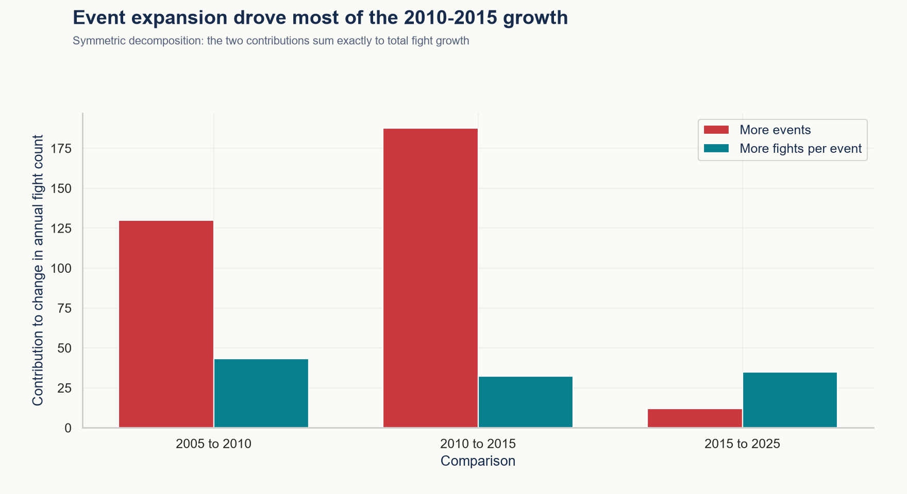

### Did fight volume grow through more events or larger cards?

From 2010 to 2015, fight volume changed by 220; the exact decomposition attributes 187.7 fights to event count and 32.3 to card size.

**Interpretation and limits:** This symmetric accounting identity divides the interaction equally. It explains arithmetic contributions, not causal drivers of the schedule.

[Supporting table](outputs/tables/deep_growth_decomposition.csv)

### Does visiting more countries mean events are evenly distributed?

In 2025 the snapshot includes 12 country/territory labels, but concentration is equivalent to only 2.19 equally represented hosts.

**Interpretation and limits:** The reciprocal Herfindahl index distinguishes geographic breadth from geographic balance. It weights events, not fighters or audience reach.

[Supporting table](outputs/tables/deep_geographic_concentration.csv)

### How much of the active roster consists of new UFC entrants?

In 2025, 95 of 620 active fighters (15.3%) had their first observed UFC bout that year.

**Interpretation and limits:** A first observed appearance is not necessarily a professional debut. Annual counts omit inactive athletes, so this is participation rather than roster size.

[Supporting table](outputs/tables/deep_entrant_flow.csv)

### How persistent is yearly fighter participation?

Among 629 fighters active in 2024, 475 (75.5%) also appear in 2025.

**Interpretation and limits:** Not returning the next year does not prove release or retirement. Injury, inactivity and incomplete source coverage can produce the same pattern; partial 2026 is excluded.

[Supporting table](outputs/tables/deep_annual_return.csv)


<a id="research-04"></a>

## 04 · What do rankings, debut matchups and early careers really reveal?

[Executed notebook](notebooks/04_fighter_analysis.ipynb) · [Answer data](outputs/tables/research_04.json)

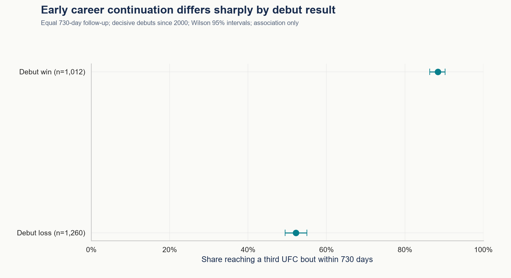

### How certain are the highest win-rate rankings?

With a 10-decisive-fight minimum, Khabib Nurmagomedov leads at 13/13 (100.0%); the descriptive Wilson interval is 77.2%-100.0%.

**Interpretation and limits:** The table shows how leaders change at 5, 10 and 20 fights. Intervals overlap and ignore opponent quality and athlete dependence; the ranking is not a definitive skill ordering.

[Supporting table](outputs/tables/deep_ranking_stability.csv)

### How do UFC newcomers fare against established UFC opponents?

In 512 decisive matchups since 2000 with exactly one newcomer and an opponent with at least five prior UFC bouts, the newcomer wins 43.2%.

**Interpretation and limits:** Prior UFC experience is measured before the date. Newcomers may have extensive experience elsewhere, and matchmaking is selective.

[Supporting table](outputs/tables/deep_debut_matchups.csv)

### Does the age association strengthen as the age gap widens?

Younger-fighter win share is 52.3% for gaps up to two years and 69.2% for gaps over ten years. The four bands are monotonically increasing.

**Interpretation and limits:** Compare the bands and their sample sizes rather than assuming a linear age effect. Equal-age and missing-DOB bouts are excluded.

[Supporting table](outputs/tables/deep_age_gap.csv)

### Is a successful UFC debut associated with more early opportunities?

Among debutants with 730 observable follow-up days, 88.4% of debut winners and 52.2% of debut losers reach three observed UFC bouts within that window.

**Interpretation and limits:** Every entrant has the same follow-up horizon. This is observed participation, not a retention contract or causal effect; recent censored entrants and ambiguous same-day debuts are excluded.

[Supporting table](outputs/tables/deep_career_continuation.csv)


<a id="research-05"></a>

## 05 · Can composition, schedules and rematches explain outcomes?

[Executed notebook](notebooks/05_fight_analysis.ipynb) · [Answer data](outputs/tables/research_05.json)

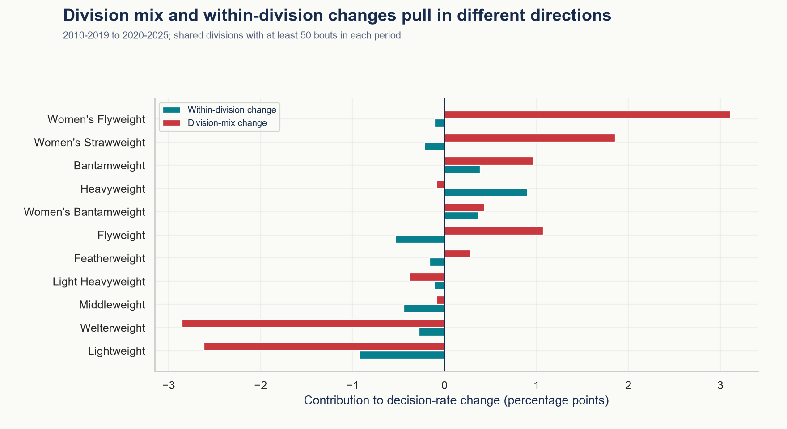

### Which divisions drive the change in decision share?

On shared divisions, within-division changes contribute -1.12 percentage points and division-mix changes contribute +1.71. Lightweight has the most negative within-division contribution (-0.93 points).

**Interpretation and limits:** The contributions sum exactly to the shared-cohort rate change, which differs from the all-division change. This is a symmetric accounting decomposition, not causal attribution.

[Supporting table](outputs/tables/deep_decision_decomposition.csv)

### Where are judges less often unanimous when a fight reaches a decision?

Among divisions with at least 100 decisions, Welterweight has the largest split-or-majority share: 23.0% of 657 decisions.

**Interpretation and limits:** The denominator is decided bouts, not every fight. Split or majority results indicate disagreement in scorecards, not proof of a wrong verdict or bias.

[Supporting table](outputs/tables/deep_divided_decisions.csv)

### Do title and non-title fights differ when both have five-round schedules?

Among standard five-round bouts in 2020-2025, decision shares are 47.0% for title fights and 47.6% for non-title fights.

**Interpretation and limits:** Matching scheduled length and period removes two obvious differences. Division and athlete selection remain uncontrolled, so title status is not a treatment effect.

[Supporting table](outputs/tables/deep_title_schedule.csv)

### How often does the first winner win the first UFC rematch?

The original winner repeats in 59.2% of 174 eligible first rematches with decisive results in both meetings.

**Interpretation and limits:** Only the second observed UFC meeting is counted for each unordered pair. Rematches are selectively booked; results do not generalize to all hypothetical rematches.

[Supporting table](outputs/tables/deep_rematches.csv)


<a id="research-06"></a>

## 06 · What changes within fights after accounting for exposure and survival?

[Executed notebook](notebooks/06_round_analysis.ipynb) · [Answer data](outputs/tables/research_06.json)

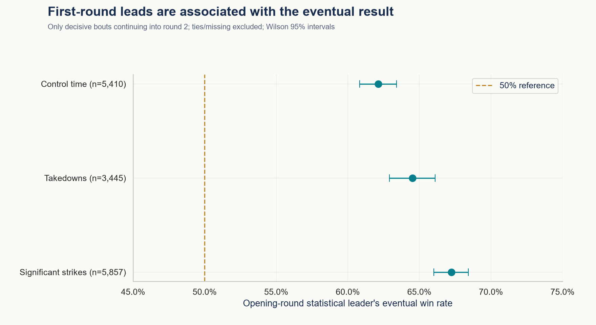

### Is later-round finishing still lower after accounting for time exposed?

For standard three-round bouts, finish incidence per 100 observed fight-minutes is round 1: 6.16, round 2: 4.94, round 3: 2.90.

**Interpretation and limits:** Incidence uses actual elapsed exposure, while conditional risk uses fights reaching the round. Neither removes survivor selection or gives an individual instantaneous hazard.

[Supporting table](outputs/tables/deep_round_exposure.csv)

### Do the same fighters change striking pace between full rounds?

Among 4,361 standard three-round bouts reaching round 3, round-2 striking changes by +0.306 landed strikes per minute versus round 1 (event-bootstrap interval +0.254 to +0.358).

**Interpretation and limits:** Both rounds are full five-minute exposures for the same fighter-bouts. This removes between-round composition differences but restricts the conclusion to bouts surviving two rounds.

[Supporting table](outputs/tables/deep_paired_round_pace.csv)

### How informative is leading the first round when the fight continues?

The first-round significant-strike leader wins 67.2% of 5,857 eligible continuing bouts.

**Interpretation and limits:** This is a within-fight descriptive association, not a pre-fight model feature or a claim about judges awarding round 1. Ties and missing measures are excluded separately for each metric.

[Supporting table](outputs/tables/deep_opening_round_leads.csv)

### Can control-time trends be compared throughout UFC history?

Annual known-control coverage spans 0.0%-100.0%; from 2010 onward the minimum is 100.0%.

**Interpretation and limits:** Missing historical control is not evidence that fighters did not control opponents. Restrict comparisons to years with adequate coverage and show observation counts.

[Supporting table](outputs/tables/deep_control_coverage.csv)


<a id="research-07"></a>

## 07 · Which physical associations survive adjustment and sensitivity checks?

[Executed notebook](notebooks/07_statistical_analysis.ipynb) · [Answer data](outputs/tables/research_07.json)

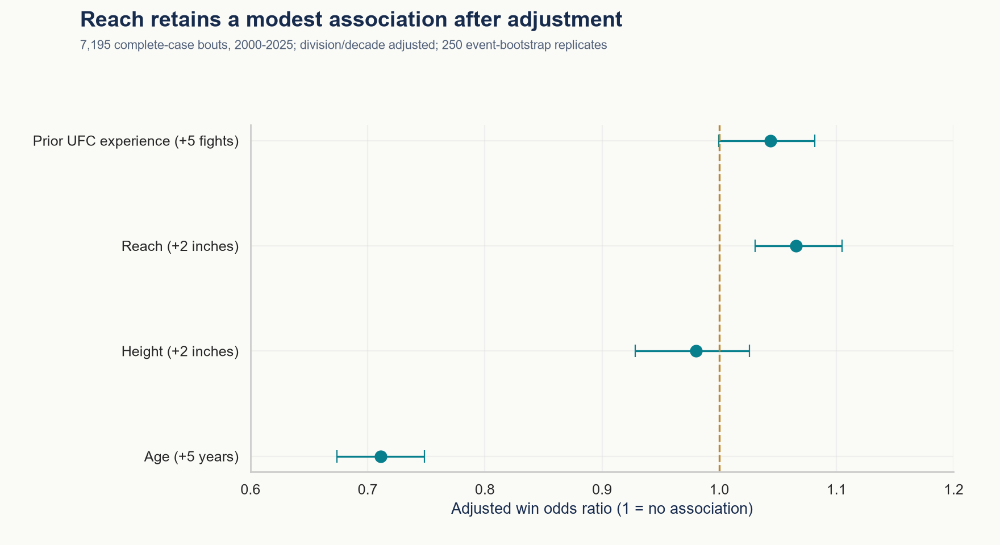

### Does the reach association survive adjustment for other fighter characteristics?

On the same 7,195 complete-case bouts, the crude odds ratio per additional 2 inches of reach is 1.079; the adjusted ratio is 1.066 (250-replicate event-bootstrap 95% interval 1.031-1.105).

**Interpretation and limits:** The exploratory logistic model includes age, height and prior UFC experience differences plus division and decade indicators. Measurements are snapshot traits; missingness, matchup quality and recurring fighters prevent a causal interpretation. Odds ratios are not percentage-point changes.

[Supporting table](outputs/tables/deep_adjusted_attributes.csv)

### Does age still have an association after allowing for UFC experience?

A five-year age difference has adjusted odds ratio 0.711 (interval 0.674-0.748) for the older fighter, holding the included covariates fixed.

**Interpretation and limits:** Age and experience are not interchangeable. Linear log-odds, selected complete cases, mild numerical regularization (C=1,000,000) and residual confounding limit the result.

[Supporting table](outputs/tables/deep_adjusted_attributes.csv)

### How much of the height-reach correlation reflects different divisions?

Among 2,079 unique fighters, pooled Pearson correlation is 0.891; after removing modal-division means it is 0.635.

**Interpretation and limits:** Each fighter appears once and is assigned their most-observed division. The residual correlation measures within-group linear association; athletes competing in multiple divisions make this grouping approximate.

[Supporting table](outputs/tables/deep_within_division_correlation.csv)

### What happens when comparing reach among similarly aged opponents?

For opponents within two years of age, the longer-reach fighter wins 52.2% across 1,968 bouts.

**Interpretation and limits:** An age caliper is a transparent sensitivity check, not full matching. It changes the eligible population and still leaves division, skill and height differences.

[Supporting table](outputs/tables/deep_reach_age_caliper.csv)


<a id="research-08"></a>

## 08 · Which features help, when does the model fail, and how robust is its lift?

[Executed notebook](notebooks/08_machine_learning.ipynb) · [Answer data](outputs/tables/research_08.json)

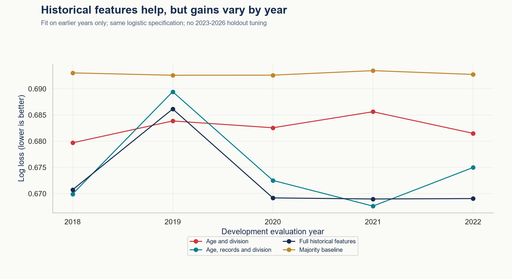

### Do richer histories help consistently before the held-out test period?

Across five expanding-year evaluations in 2018-2022, full historical features improve log loss in 4 of five years. Weighted log loss is 0.6730, compared with 0.6827 for age and division alone.

**Interpretation and limits:** The same logistic specification is used for each feature family and preprocessing is refitted inside each chronological fold. Inspect year-specific results for consistency. These are exploratory development checks, not a newly untouched benchmark.

[Supporting table](outputs/tables/deep_feature_ablation_summary.csv)

### How stable is the selected model across held-out years?

Annual accuracy ranges from 57.5% to 64.5% in the existing 2023-2026 holdout.

**Interpretation and limits:** These are diagnostics of the already evaluated model, not a reason to select a different model on the same holdout. The final year has fewer months and fights.

[Supporting table](outputs/tables/deep_model_years.csv)

### Are the model’s most confident predictions more reliable?

Accuracy rises from 51.8% in the lowest populated confidence band (n=575) to 79.5% in the highest (n=78); the highest band's mean predicted confidence is 72.1%.

**Interpretation and limits:** Compare mean confidence with observed accuracy and interval width. No confidence cutoff is optimized on these test data; small high-confidence groups can be noisy.

[Supporting table](outputs/tables/deep_model_confidence.csv)

### Does the model improve on always choosing the source red corner?

The selected model improves accuracy by 4.65 percentage points on the same fights; the paired event-bootstrap interval is 1.49 to 7.88 points.

**Interpretation and limits:** Pairing comparisons within the same fight is more informative than comparing two separate accuracy intervals. Recurring fighters across events still create unmodeled dependence.

[Supporting table](outputs/tables/deep_paired_model_gain.csv)


<a id="research-09"></a>

## 09 · How do bonus era and award category change the interpretation?

[Executed notebook](notebooks/06_round_analysis.ipynb) · [Answer data](outputs/tables/research_09.json)

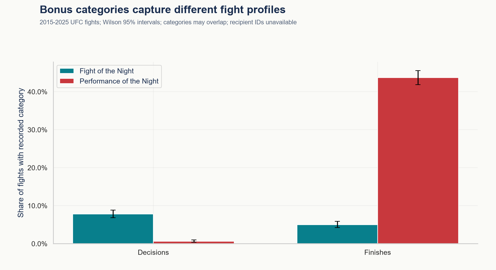

### Is the finish-bonus association still present within recent years?

In 2020-2025, 50.9% of 1,485 finishes and 8.5% of 1,484 decisions have at least one recorded bonus category.

**Interpretation and limits:** Comparisons start in 2006, the first observed bonus year, and exclude partial 2026. Recorded absence is treated as no bonus; source completeness is not independently verified. Eras reflect observed category coverage, not a causal policy experiment.

[Supporting table](outputs/tables/deep_bonus_eras.csv)

### Do Fight of the Night and performance awards tell the same story?

Across 2015-2025, Fight of the Night decorates 5.0% of finishes and 7.8% of decisions. The category table separates this from performance awards.

**Interpretation and limits:** 2014 is omitted as a transition year in the source categories. A fight can have multiple categories. Records identify decorated fights, not recipient identities or award money.

[Supporting table](outputs/tables/deep_bonus_categories.csv)

### Can division composition alone explain the modern finish-bonus gap?

Across 11 shared divisions with at least 50 finishes and 50 decisions each, pooled division weights give 48.1% for finishes versus 8.4% for decisions: a 39.71-point gap.

**Interpretation and limits:** Both outcomes use the same pooled division weights in 2015-2025. This removes that composition difference only; opponent quality, card prominence and discretionary selection remain unmeasured.

[Supporting table](outputs/tables/deep_bonus_division_standardization.csv)


<a id="research-10"></a>

## 10 · Does opponent strength improve pre-fight prediction?

[Executed notebook](notebooks/08_machine_learning.ipynb) · [Answer data](outputs/tables/research_10.json)

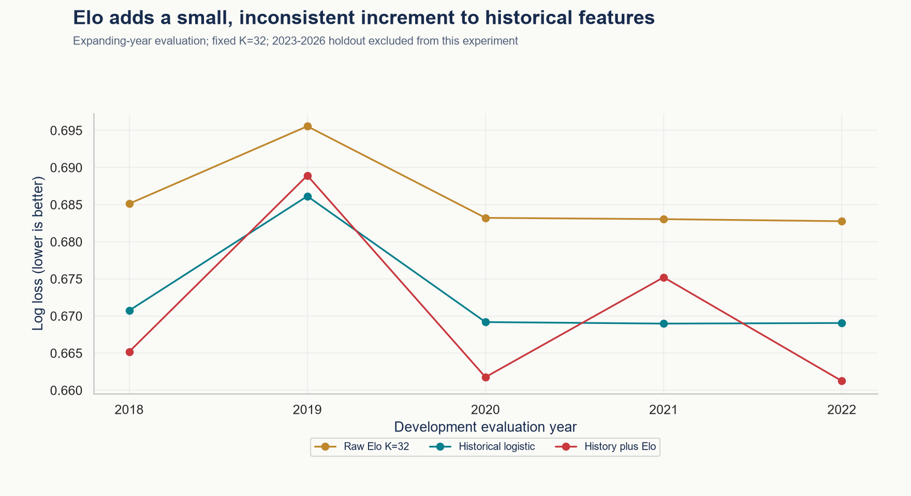

### Does opponent-adjusted Elo add information beyond the existing histories?

Adding Elo reduces development log loss by +0.0022 (paired event-bootstrap 95% interval -0.0028 to +0.0068) and improves it in 3 of five annual evaluations.

**Interpretation and limits:** 2018-2022 expanding-year evaluations share identical fights, preprocessing and logistic settings. Positive reduction favors adding Elo. These are already explored development data, not a new independent test; the published holdout model is unchanged.

[Supporting table](outputs/tables/deep_elo_gain.csv)

### How informative is an Elo probability on its own?

The fixed K=32 Elo baseline has 55.5% accuracy, log loss 0.6860, and Brier score 0.2465 across 2,422 development evaluation fights.

**Interpretation and limits:** Every fighter starts at 1500; scale is 400; ratings use all earlier UFC dates including 1993. Draws update with score 0.5 and no contests do not change ratings. There is no division reset, inactivity decay or professional record outside UFC.

[Supporting table](outputs/tables/deep_elo_summary.csv)

### How sensitive are raw Elo probabilities to the update speed?

For K=16, 32 and 64, weighted development log loss ranges from 0.6846 to 0.6885.

**Interpretation and limits:** All three settings are reported as a sensitivity study. K=32 is the fixed feature specification; the best observed setting is not selected on the 2023-2026 holdout. Faster updates react more strongly to recent results and can change calibration.

[Supporting table](outputs/tables/deep_elo_folds.csv)

### Are raw Elo probabilities calibrated across their probability range?

Among K=32 bins with at least 50 fights, the largest observed calibration gap is 3.1 points: mean predicted 36.4%, observed 33.3% (n=54).

**Interpretation and limits:** Fixed probability bins describe fighter A's win chance, not confidence in a predicted winner. Wilson intervals ignore recurring fighters. Binning loses detail; this diagnostic does not recalibrate probabilities on the same observations.

[Supporting table](outputs/tables/deep_elo_calibration.csv)


<a id="research-11"></a>

## 11 · What changes after a long gap between UFC appearances?

[Executed notebook](notebooks/04_fighter_analysis.ipynb) · [Answer data](outputs/tables/research_11.json)

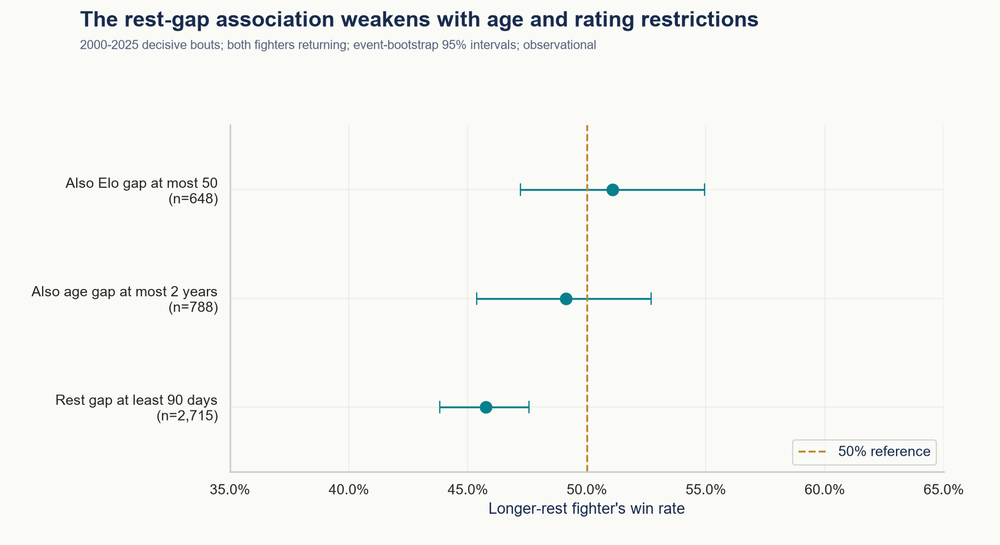

### Do fighters returning after a year win less often?

Returning fighters with a gap over 365 days win 42.9% of 1,423 appearances, versus 51.8% of 12,420 appearances after shorter gaps.

**Interpretation and limits:** Decisive UFC bouts in 2000-2025 only; debutants have no UFC rest interval and are excluded. Appearances, not independent fights, are the denominator. A long gap does not identify injury, retirement, suspension or the cause of absence.

[Supporting table](outputs/tables/deep_layoff_bands.csv)

### Does the rest-gap association persist among similar-age, similar-rating opponents?

When rest gaps differ by at least 90 days, age by at most two years and pre-fight Elo by at most 50, the longer-rest fighter wins 51.1% of 648 bouts (event-bootstrap interval 47.2%-55.0%).

**Interpretation and limits:** These fixed calipers restrict the population and may discard many bouts. Both fighters must have prior UFC appearances. This is a sensitivity check, not random assignment or a fully adjusted causal comparison.

[Supporting table](outputs/tables/deep_layoff_matched.csv)

### Is age composition a plausible explanation for the raw inactivity comparison?

Among returning fighters aged at least 35, win shares are 39.1% after gaps over one year and 41.4% after shorter gaps. The age-stratified table shows all three age groups and their sample sizes.

**Interpretation and limits:** Age strata expose one compositional difference but do not establish mediation or remove strength, era and matchup selection. Wilson intervals are descriptive and ignore recurring fighters.

[Supporting table](outputs/tables/deep_layoff_age.csv)

### Has the time between observed UFC appearances changed by era?

Median return intervals are 147 days in 2000-2009 and 189 days in 2020-2025; the recent era's 90th percentile is 406 days.

**Interpretation and limits:** These intervals are observed only when a fighter returns for a decisive bout. Athletes who never return are absent, so this is not a time-to-return survival analysis. Earlier non-decisive appearances still reset the previous-fight date.

[Supporting table](outputs/tables/deep_layoff_eras.csv)


<a id="research-12"></a>

## 12 · How does the frozen model generalize across fighter familiarity?

[Executed notebook](notebooks/08_machine_learning.ipynb) · [Answer data](outputs/tables/research_12.json)

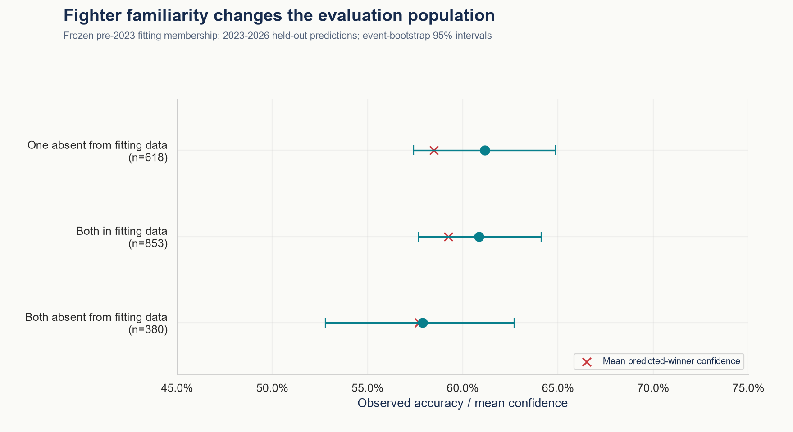

### How often does the held-out model face fighters absent from its fitting sample?

998 of 1,851 held-out fights (53.9%) include at least one fighter absent from the pre-2023 model-fitting rows.

**Interpretation and limits:** Familiarity is fixed using IDs in the actual decisive development cohort. An athlete remains absent from the fitting sample even after earlier test appearances update their historical features. This is not the same as a UFC debut or absence from all source history.

[Supporting table](outputs/tables/deep_generalization_familiarity.csv)

### How does prediction quality change with the least-experienced opponent?

Accuracy is 58.2% when at least one fighter is a UFC debutant, versus 61.8% when both have at least five earlier UFC bouts.

**Interpretation and limits:** Experience is measured strictly before each fight date. These are diagnostic slices of the already evaluated 2023-2026 model, with 2026 partial. No model, threshold or subgroup is selected for deployment from these results.

[Supporting table](outputs/tables/deep_generalization_experience.csv)

### Does the model improve probability quality in every reportable familiarity group?

The lowest reportable Brier skill is 5.5% for 'Both absent from fitting data' (n=380); all reportable groups improve over the fixed development-prevalence forecast.

**Interpretation and limits:** Brier skill equals one minus model squared probability error divided by reference error on the same fights. A negative value is worse than that constant forecast. The reference prevalence is learned before 2023, not from each subgroup; metrics below 30 fights are withheld.

[Supporting table](outputs/tables/deep_generalization_familiarity.csv)

### Which familiarity group contributes the most observed model errors?

'Both in fitting data' contributes 334 errors (45.5% of all held-out errors); 40 have predicted-winner confidence of at least 65%.

**Interpretation and limits:** Error volume depends on how often a group occurs, not just its error rate. The 65% threshold is a fixed descriptive cut, not an optimized action rule. Confidence is a model probability and does not establish that a matchup was objectively predictable.

[Supporting table](outputs/tables/deep_generalization_errors.csv)

## Reproduce the analysis

From the repository root, install the pinned requirements and run:

```powershell
python -m pip install -r requirements.txt
python -m src.notebooks --build --execute
python -m src.pipeline --all
python -m src.provenance
python -m pytest -q
```

The full pipeline rebuilds all research tables, answer files, figures and this report. To refresh one notebook, run `python -m src.research_notebooks 04` (substitute 01–08). No downloads or API credentials are required for the analysis.

The final pipeline run records SHA-256 digests of analysis source files, raw inputs and generated artifacts in `outputs/artifact_manifest.json`, along with Python/package versions. Verification detects changed, missing or newly added files; text line endings are normalized for Windows/Linux portability, while original raw CSVs remain byte-exact. It verifies consistency with the recorded full rebuild, not external data completeness or mathematical correctness. Individual notebook runs can change generated outputs; rerun the full pipeline before final verification. Notebook execution is checked separately.
